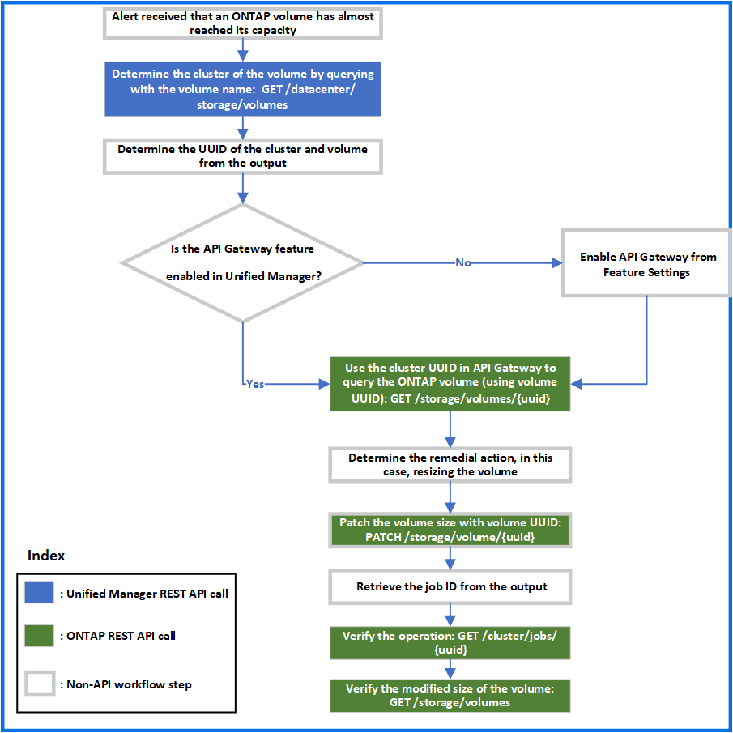

= ゲートウェイ API を使用した ONTAP ボリュームのトラブルシューティング
:allow-uri-read: 
:icons: font
:imagesdir: ../media/

[role="lead"]
ゲートウェイ API はゲートウェイとして機能し、 ONTAP API を呼び出して ONTAP ストレージオブジェクトに関する情報を照会し、報告された問題に対処するための修復方法を実行します。

このワークフローでは、 ONTAP ボリュームの容量がほぼフルに達したときにイベントが生成されるユースケースの例を示します。また、 Active IQ Unified Manager と ONTAP の REST API を組み合わせて呼び出すことで、この問題に対処する方法についても説明します。

[NOTE]
====
ワークフローの手順を実行する前に、次の点を確認してください。

* ゲートウェイの API とその使用方法を理解しておきます。詳細については、「 Gateway API 」の項を参照してください。

xref:concept-gateway-apis.adoc[プロキシアクセスを介して ONTAP API にアクセスする]

* ONTAP REST API の使用について理解しておく必要があります。ONTAP REST APIの使用については、を参照してください https://docs.netapp.com/us-en/ontap-automation/index.html["ONTAP 自動化に関するドキュメント"]。
* あなたはアプリケーション管理者です。
* REST API 処理を実行するクラスタは ONTAP 9.5 以降でサポートされており、クラスタは HTTPS 経由で Unified Manager に追加されます。

====
次の図は、 ONTAP of 問題ボリュームの容量使用に関するトラブルシューティングワークフローの各手順を示しています。

このワークフローでは、 Unified Manager と ONTAP REST API の呼び出しポイントを取り上げます。

. ボリュームの容量利用率を通知するイベントからボリューム名をメモします。
. ボリューム名をの値として使用します `name` パラメータは、次のUnified Manager APIを実行してボリュームを照会します。

[cols="3*"]
|===
| カテゴリ | HTTP 動詞 | パス 

 a| 
データセンター
 a| 
取得
 a| 
`/datacenter/storage/volumes`

|===
. 出力からクラスタ UUID とボリューム UUID を取得します。
. Unified Manager Web UI で、 * 一般 * > * 機能設定 * > * API ゲートウェイ * と移動して、 API ゲートウェイ機能が有効になっているかどうかを確認します。有効になっていない場合は、のAPIが表示されます `gateway` 呼び出しできるカテゴリがありません。機能が無効になっている場合は、有効にします。
. クラスタUUIDを使用してONTAP APIを実行します `+/storage/volumes/{uuid}+` APIゲートウェイを使用：API パラメータとしてボリューム UUID を指定した場合、クエリはボリュームの詳細を返します。

ONTAP API を API ゲートウェイ経由で実行する場合、 Unified Manager のクレデンシャルは認証のために内部で渡されます。このため、個々のクラスタアクセスに対して追加の認証手順を実行する必要はありません。

[cols="3*"]
|===
| カテゴリ | HTTP 動詞 | パス 

 a| 
Unified Manager ：ゲートウェイ

ONTAP ストレージ
 a| 
取得
 a| 
ゲートウェイAPI： `+/gateways/{uuid}/{path}+`

ONTAP API： `+/storage/volumes/{uuid}+`

|===
[NOTE]
====
インチ `+/gateways/{uuid}/{path}+`、の値 `+{uuid}+` REST処理を実行するクラスタUUIDに置き換える必要があります。 `+{path}+` ONTAP REST URLに置き換える必要があります `+/storage/volumes/{uuid}+`。

====
追加されるURLは次のとおりです。 `+/gateways/{cluster_uuid}/storage/volumes/{volume_uuid}+`

を実行している `GET` 処理の場合、生成されるURLは次のとおりです。 `+GEThttps://<hostname>/api/gateways/<cluster_UUID>/storage/volumes/{volume_uuid}+`

* cURL コマンドの例 *

[listing]
----
curl -X GET "https://<hostname>/api/gateways/1cd8a442-86d1-11e0-ae1c-9876567890123/storage/volumes/028baa66-41bd-11e9-81d5-00a0986138f7"
-H "accept: application/hal+json" -H "Authorization: Basic <Base64EncodedCredentials>"
----
. 出力から、取得するサイズ、使用状況、および修復方法を確認します。このワークフローで実施する修復方法は、ボリュームのサイズを変更することです。
. ボリュームのサイズを変更するには、クラスタ UUID を使用し、 API ゲートウェイから次の ONTAP API を実行してください。ゲートウェイと ONTAP API の入力パラメータについては、ステップ 5 を参照してください。

[cols="3*"]
|===
| カテゴリ | HTTP 動詞 | パス 

 a| 
Unified Manager ：ゲートウェイ

ONTAP ストレージ
 a| 
パッチ
 a| 
ゲートウェイAPI： `+/gateways/{uuid}/{path}+`

ONTAP API： `+/storage/volumes/{uuid}+`

|===
[NOTE]
====
クラスタUUIDとボリュームUUIDに加え、の値を入力する必要があります `size` ボリュームのサイズを変更するためのパラメータ。値をバイト単位で入力してください。たとえば、ボリュームのサイズを100GBから120GBに拡張する場合は、パラメータに値を入力します `size` クエリの最後に次のように入力します。 `-d {\"size\": 128849018880}"`

====
* cURL コマンドの例 *

[listing]
----
curl -X PATCH "https://<hostname>/api/gateways/1cd8a442-86d1-11e0-ae1c-9876567890123/storage/volumes/028baa66-41bd-11e9-81d5-00a0986138f7" -H
    "accept: application/hal+json" -H "Authorization: Basic <Base64EncodedCredentials>" -d
    {\"size\": 128849018880}"
----
JSON 出力でジョブ UUID が返されます。

. ジョブ UUID を使用して、ジョブが正常に実行されたかどうかを確認します。クラスタ UUID とジョブ UUID を使用して、 API ゲートウェイ経由で次の ONTAP API を実行します。ゲートウェイと ONTAP API の入力パラメータについては、ステップ 5 を参照してください。

[cols="3*"]
|===
| カテゴリ | HTTP 動詞 | パス 

 a| 
Unified Manager ：ゲートウェイ

ONTAP クラスタ
 a| 
取得
 a| 
ゲートウェイAPI： `+/gateways/{uuid}/{path}+`

ONTAP API： `+/cluster/jobs/{uuid}+`

|===
返される HTTP コードは、 ONTAP REST API の HTTP ステータスコードと同じです。

. 次の ONTAP API を実行して、サイズ変更されたボリュームの詳細を照会します。ゲートウェイと ONTAP API の入力パラメータについては、ステップ 5 を参照してください。

[cols="3*"]
|===
| カテゴリ | HTTP 動詞 | パス 

 a| 
Unified Manager ：ゲートウェイ

ONTAP ストレージ
 a| 
取得
 a| 
ゲートウェイAPI： `+/gateways/{uuid}/{path}+`

ONTAP API： `+/storage/volumes/{uuid}+`

|===
出力には、拡張後のボリュームサイズとして 120GB が表示されます。
