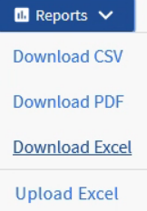

= IOPS が最も高いアグリゲートを表示するレポートの作成
:allow-uri-read: 
:icons: font
:imagesdir: ../media/

[role="lead"]
このレポートには、新しいワークロードをプロビジョニングできるアグリゲートタイプごとの IOPS が最も使用可能なアグリゲートが表示されます。

== 作業を開始する前に

* アプリケーション管理者またはストレージ管理者のロールが必要です。

== このタスクについて

次の手順に従って、健全性を開きます。すべてのボリュームビュー、 Excel でのビューのダウンロード、使用可能な容量グラフの作成、カスタマイズした Excel ファイルのアップロード、最終レポートのスケジュール設定を行います。

== 手順

. 左側のナビゲーションペインで、 * Storage * > * Aggregates * をクリックします。
. View * ドロップダウンから * Performance ： All aggregates * を選択します。
. を表示するには、*表示/非表示*を選択します `Available IOPS` を表示および非表示にします `Cluster FQDN`、 `Inactive Data Reporting`および `Threshold Policy` 列（Columns）：
. をドラッグアンドドロップします `Available IOPS` および `Free Capacity` の横にある列 `Type` 列（Column）：
. カスタムビューに名前を付けて保存します `Available IOPS Per Aggr`。
. [* レポート *>] > [* Excel のダウンロード *] を選択します。
+

+
ブラウザによっては、ファイルを保存するために * OK * をクリックする必要があります。

. 必要に応じて、 * 編集を有効にする * をクリックします。
. Excel で、ダウンロードしたファイルを開きます。
. をクリックします `data` シートの左上にある小さな三角形をクリックして、シート全体を選択します。
. [*データ*]リボンで、から[*並べ替え*]を選択します `Sort & Filter` 面積（Area）：
. 次のソートレベルを設定します。
+
.. 「*並べ替え基準*」を指定します `Available IOPS (IOPS)`、*ソートオン*を指定します `Cell Values`および*注文* AS `Largest to Smallest`。
.. [ レベルの追加 ] をクリックします。
.. 「*並べ替え基準*」を指定します `Type`、*ソートオン*を指定します `Cell Values`および*注文* AS `Z to A`。
.. [ レベルの追加 ] をクリックします。
.. 「*並べ替え基準*」を指定します `Free Capacity (GB)`、*ソートオン*を指定します `Cell Values`および*注文* AS `Largest to Smallest`。
.. [OK] をクリックします。

. Excel ファイルを保存して閉じます。
. Unified Manager で、 * Reports * > * Upload Excel * を選択します。
+
[NOTE]
====
Excel ファイルをダウンロードしたときと同じビューに表示されていることを確認します。

====
. 変更したExcelファイルを選択します（この場合） `performance-aggregates-<date>.xlsx`。
. * 開く * をクリックします。
. [Submit （送信） ] をクリックします。
+
[*Reports*>*Upload Excel*] メニュー項目の横にチェックマークが表示されます。

+
image::../media/upload-excel.png[Excel をアップロードします]

. [ スケジュール済みレポート ] をクリックします。
. [ * スケジュールの追加 * ] をクリックして、新しいレポートのスケジュール特性を定義できるように、 [ レポートスケジュール * ] ページに新しい行を追加します。
. レポートスケジュールの名前を入力し、他のレポートフィールドに情報を入力して、チェックマーク（image:../media/blue-check.gif[""]）をクリックします。
+
[NOTE]
====
レポートの *XLSX* 形式を選択します。

====
+
レポートはテストとしてすぐに送信されます。その後、指定した頻度でレポートが生成され、リスト内の受信者に E メールで送信されます。

== 完了後

レポートに表示された結果を基に、使用可能な IOPS が最も高いアグリゲートに新しいワークロードをプロビジョニングできます。
