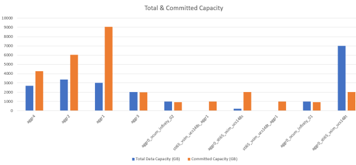

= アグリゲートの容量の表とグラフを表示するレポートの作成
:allow-uri-read: 
:icons: font
:imagesdir: ../media/

[role="lead"]
合計とクラスタ化された棒グラフ形式を使用して、 Excel ファイルの容量を分析するレポートを作成できます。

== 作業を開始する前に

* アプリケーション管理者またはストレージ管理者のロールが必要です。

== このタスクについて

次の手順に従って、健全性を開きます。すべてのアグリゲートビュー、 Excel でのビューのダウンロード、使用可能な容量グラフの作成、カスタマイズした Excel ファイルのアップロード、最終レポートのスケジュール設定を行います。

== 手順

. 左側のナビゲーションペインで、 * Storage * > * Aggregates * をクリックします。
. [* レポート *>] > [* Excel のダウンロード *] を選択します。
+
image::../media/download-excel-menu.png[Excel メニューをダウンロードします]

+
ブラウザによっては、ファイルを保存するために * OK * をクリックする必要があります。

. 必要に応じて、 * 編集を有効にする * をクリックします。
. Excel で、ダウンロードしたファイルを開きます。
. 新しいシートを作成します（image:../media/excel-new-sheet-icon.png[""]）をクリックします `data` シート名と名前*総データ容量*。
. 新しい合計データ容量シートに次の列を追加します。
+
.. 合計データ容量（ GB ）
.. コミット済み容量（ GB ）
.. 使用済みデータ容量（ GB ）
.. 使用可能なデータ容量（ GB ）

. 各列の最初の行に、次の式を入力します。必ずを参照してください `data` シート（data!）をクリックし、取得したデータの正しい列と行の指定子を参照します（合計データ容量は列Eの行2から20までのデータを取得します）。
+
.. = 合計（ DATA ！ E$2 ： DATA ！ E$20 ）
.. = 合計（ DATA ！ F$2 ： DATA ！ F$50 ）
.. = 合計（ DATA ！ G$2 ： DATA ！ G$50 ）
.. = 合計（データ！ H$2 ：データ！ H$50 ）

+
数式は、現在のデータに基づいて各列の合計を計算します。

image::../media/capacitysums.png[容量]

. をクリックします `data` シートで、合計データ容量（GB）列とコミット容量（GB）列を選択します。
. [ * 挿入 * （ Insert * ） ] メニューから [ * 推奨チャート * （ Recommended Charts * ） ] を選択し、 [ * クラスタ化された列 * （ * Clustered Column
. グラフを右クリックし、[グラフの移動]を選択して、グラフをに移動します `Total Data Capacity` シート（Sheet）：
. グラフを選択したときに使用できる * デザイン * および * フォーマット * メニューを使用して、グラフの外観をカスタマイズできます。
. 必要に応じて、ファイルに変更を保存します。ファイルの名前や場所は変更しないでください。
+

. Unified Manager で、 * Reports * > * Upload Excel * を選択します。
+
[NOTE]
====
Excel ファイルをダウンロードしたときと同じビューに表示されていることを確認します。

====
. 変更した Excel ファイルを選択します。
. * 開く * をクリックします。
. [Submit （送信） ] をクリックします。
+
[*Reports*>*Upload Excel*] メニュー項目の横にチェックマークが表示されます。

+
image::../media/upload-excel.png[Excel をアップロードします]

. [ スケジュール済みレポート ] をクリックします。
. [ * スケジュールの追加 * ] をクリックして、新しいレポートのスケジュール特性を定義できるように、 [ レポートスケジュール * ] ページに新しい行を追加します。
+
[NOTE]
====
レポートの *XLSX* 形式を選択します。

====
. レポートスケジュールの名前を入力し、他のレポートフィールドに情報を入力して、チェックマーク（image:../media/blue-check.gif[""]）をクリックします。
+
レポートはテストとしてすぐに送信されます。その後、指定した頻度でレポートが生成され、リスト内の受信者に E メールで送信されます。

== 完了後

レポートに表示された結果を基に、ネットワーク全体で使用可能な容量を最大限に活用する方法を調査できます。
